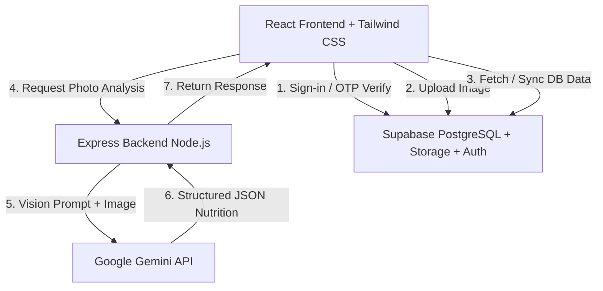

# NutriSnap AI ✦ Technical Interview Preparation Guide

This document is designed to help you present and explain the **NutriSnap AI** project in technical interviews. It highlights the architecture, design choices, challenges overcome, and key technical talking points.

---

## 1. Project Overview (The "Elevator Pitch")
> *"NutriSnap AI is a full-stack health application that leverages computer vision to automate calorie and macro-nutrient tracking. Users snap a photo of their meal, and the app uses the Google Gemini AI vision model to instantly identify ingredients, estimate portion sizes, and calculate detailed nutritional values. The data is synchronized in real-time to a Supabase cloud database, protected by passwordless OTP authentication."*

---

## 2. Technical Architecture & System Design

### Key Components:
1.  **Frontend (React, TypeScript, Tailwind CSS)**:
    *   State-driven dashboard with a high-fidelity visual dashboard.
    *   Interactive SVG circular progress dials for caloric and macronutrient monitoring.
    *   Responsive layout optimized for mobile capture.
2.  **Backend (Express, Node.js)**:
    *   Acts as a secure proxy to interact with the Google GenAI SDK.
    *   Handles structured JSON responses directly from Gemini.
    *   Includes self-healing server launch scripts.
3.  **Database & Authentication (Supabase)**:
    *   **PostgreSQL**: Secure storage for user profiles, logs, and meals.
    *   **Supabase Storage**: Bucket storage (`meal-photos`) for snapped food images.
    *   **Supabase Auth**: Realizes passwordless OTP logins directly to the user's Gmail.

---

## 3. High-Value Technical Talking Points (What to Highlight)

When interviewers ask about your coding decisions, highlight these five key engineering implementations:

### ⚙️ Talking Point 1: API Robustness (Exponential Backoff & Model Fallback)
*   **The Problem**: AI models occasionally experience temporary spikes in demand (resulting in `503 Service Unavailable` or `429 Rate Limit` errors).
*   **Your Solution**: Implemented a custom wrapper function (`generateGeminiContentWithRetry`) in the Express server. If an API call fails with a temporary status, the server:
    1.  Retries the request with **exponential backoff** (retrying after 1s, then 2s, up to 3 times).
    2.  If it still fails, it automatically **falls back to alternative models** (e.g. switching from `gemini-2.5-flash` to the highly stable `gemini-1.5-flash` or `gemini-3.5-flash`) to guarantee service uptime.

### ⚙️ Talking Point 2: Production Pruning Safety (Dynamic Import)
*   **The Problem**: Render (and other hosts) prune `devDependencies` in production to reduce container sizes. Vite is a devDependency, but was statically imported in `server.ts` for local development middleware, causing startup crashes in production.
*   **Your Solution**: Refactored the imports in `server.ts` to load Vite **dynamically** (`await import("vite")`) only if the server detects it is running locally. Combined with auto-detection for cloud environments (`process.env.RENDER === "true"`), the server runs completely crash-free in production without needing Vite installed.

### ⚙️ Talking Point 3: Defending Against Brute Force (UI OTP Attempts Limit)
*   **The Problem**: Passwordless OTP systems can be vulnerable to brute force code entry attempts.
*   **Your Solution**: Implemented a strict **5-attempt limit** in `AuthScreens.tsx`. If a user enters the incorrect OTP code 5 times, the UI:
    1.  Clears the generated token from memory.
    2.  Disables all inputs and the verification button.
    3.  Locks the UI and prompts the user to request a new code (which resets the counter and generates a new secure token).

### ⚙️ Talking Point 4: Resilient Database Schema & Cascade Operations
*   **The Problem**: Logging meals with dynamic sub-items requires complex relational tables.
*   **Your Solution**: Designed a relational schema in PostgreSQL containing `profiles`, `daily_logs`, `meals`, and `meal_items`. Built the schema with `ON DELETE CASCADE` constraints so that purging a meal automatically deletes its sub-ingredients from the database, maintaining data integrity without orphan records.

### ⚙️ Talking Point 5: Self-Healing Local Port Conflicts
*   **The Problem**: Developers often get `EADDRINUSE` crashes if port 3000 is occupied by an orphaned process.
*   **Your Solution**: Programmed the Express server listener to catch the `EADDRINUSE` error. Instead of crashing, it automatically detects the conflict, prints a console warning, and shifts to the next available port (e.g. 3001, 3002) recursively.

---

## 4. Tough Interview Q&A

### Q1: Why did you choose Supabase instead of writing a custom MongoDB/Express Auth server?
> **Answer**: *"Supabase provides PostgreSQL database and native integration with GoTrue auth out of the box. By leveraging Supabase Auth, we saved development time that would have been spent writing bcrypt password hashing, session tokens, JWT verifications, and email queues. It allowed us to focus on the core value proposition of the app: the AI visional calorie scanning engine."*

### Q2: How does the AI food analysis work under the hood?
> **Answer**: *"When the user snaps a photo, it is base64 encoded and sent to our Express backend. The backend calls the Google GenAI SDK using a system instruction and a structured schema. We define a JSON schema matching our TypeScript interfaces (total calories, nutritional grade, and an array of detected ingredients). This ensures the AI model returns a predictable JSON object instead of raw text, which we can parse and save directly to the database."*

### Q3: How did you handle CORS and proxying between frontend and backend?
> **Answer**: *"During local development, we run Vite as a middleware directly inside the Express server. The client files are served on the same host and port as our Express API. This completely eliminates CORS issues because the frontend and backend share the exact same origin."*
